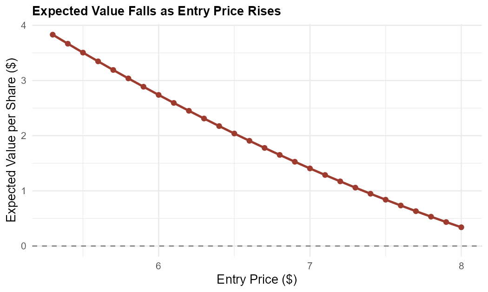
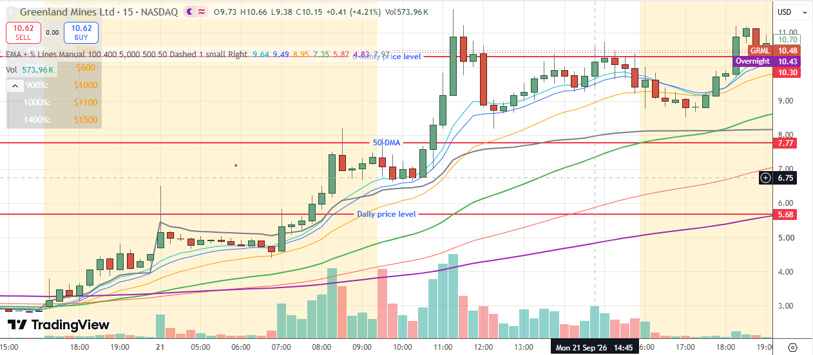
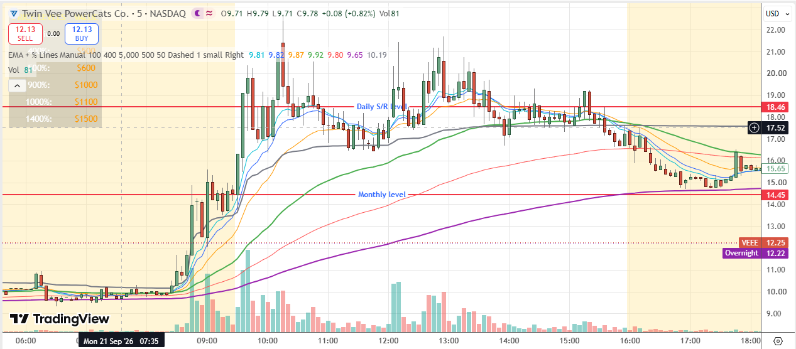

Zero trades today. Not because nothing happened — GRML and VEEE both delivered real, high-probability setups — but because I missed the first entry on both, and chose not to chase either one. That decision was correct, and the reason it was correct has a name: expected value.

```{=html}
<div class="stat-row">
<div class="stat-box"><span class="label">Trades Taken</span><span class="value">0</span></div>
<div class="stat-box gold"><span class="label">GRML Real High</span><span class="value">$9.96 (+249%)</span></div>
<div class="stat-box gold"><span class="label">VEEE Move Missed</span><span class="value">$14.45 → $22 est.</span></div>
<div class="stat-box"><span class="label">Avg. Hold Time (own data)</span><span class="value">~71 min</span></div>
</div>
```

## The math behind saying no

Expected value is the average outcome of a trade if it were repeated thousands of times:

**EV = (P(Win) × Size of Win) − (P(Loss) × Size of Loss)**

Entering higher does two things to this formula at once, and both work against you: **Size of Win shrinks** (less distance left to whatever target the setup was pointing at), and on a low-float stock that's already extended, **P(Win) also drops** — a second or third retracement entry is statistically a worse bet than the first, not just a more expensive one. This is different from swing trading mid-caps and large-caps, where a confirmed breakout can keep handing out good entries as it runs. Low-float small caps are, by nature, more likely to give back a move than extend it cleanly — so getting the *first* entry matters far more here than it does in a mid-cap swing trade.

```{r}
#| label: ev-chart
#| output: false
library(ggplot2)

entry_price <- seq(5.30, 8.00, by = 0.10)
target <- 11
stop_pct <- 0.10

size_win <- target - entry_price
size_loss <- entry_price * stop_pct
p_win <- seq(0.70, 0.30, length.out = length(entry_price))  # illustrative, not measured
p_loss <- 1 - p_win

ev <- p_win * size_win - p_loss * size_loss
df <- data.frame(entry_price, ev)

p <- ggplot(df, aes(x = entry_price, y = ev)) +
  geom_line(color = "#9C3B2E", linewidth = 1.1) +
  geom_point(color = "#9C3B2E", size = 2) +
  geom_hline(yintercept = 0, linetype = "dashed", color = "grey50") +
  labs(
    x = "Entry Price ($)",
    y = "Expected Value per Share ($)",
    title = "Expected Value Falls as Entry Price Rises"
  ) +
  theme_minimal(base_size = 13) +
  theme(plot.title = element_text(face = "bold", size = 13))

ggsave("ev-vs-entry.png", plot = p, width = 7, height = 4.2, dpi = 150)
```

<figure>

<figcaption>Illustrative EV model: win probability assumed to decline linearly with entry price, target $11, stop 10% below entry. Not derived from GRML's actual measured fill data — a model of the general shape of the effect, not GRML's exact numbers.</figcaption>
</figure>

The shape is the point, not the exact numbers: a trade that's clearly positive EV at the first entry can cross into negative EV territory just a dollar or two higher, well before the stock itself shows any technical sign of stopping.

## GRML: a real setup, a real catalyst, a real number to check the math against

<span class="pill pill-hold">2.87M Float</span> <span class="pill pill-slate">Basic Materials · Precious Metals & Mining</span>

| Metric | Value |
|---|---|
| Company | Greenland Mines Ltd. — Skaergaard (gold/palladium/platinum) and Sarfartoq rare-earth projects |
| Catalyst | Trump-announced U.S.-Denmark-Greenland security framework, raising the strategic profile of Greenland-based resource projects |
| Float | 2.87M shares |
| Short Interest | 22.43% |
| Real Confirmed Price Action | Friday close $2.85 → premarket +144.56% to $6.97 → real intraday high near **$9.96** (+249.47%) |
| Recent Corporate Action | 1-for-50 reverse stock split, effected August 24, 2026 |

My own estimate of a ceiling around $11 lines up closely with the real, independently reported high of $9.96 — close enough that the setup reasoning holds up against what actually happened, not just what I hoped would happen.

### What GRML did with its balance sheet — and its share count

I went looking for "the dilution overhang" as a one-line caveat. What's actually on the record is bigger and more specific than that, and it's worth laying out as its own timeline rather than a single bullet point:

| Date | Action | Detail |
|---|---|---|
| Mar 2, 2026 | Private warrants issued | Original terms, later repriced (see Sep 21 below) |
| Aug 24, 2026 | 1-for-50 reverse stock split | Effected same day as the ATM agreement below |
| Aug 24, 2026 | $50M "at-the-market" facility opened | Sales agreement with A.G.P./Alliance Global Partners, sellable over time |
| Aug 24, 2026 | Series C Preferred conversion disclosed | **40,800,776 shares** issuable on conversion — against ~3.18M shares outstanding at the time |
| Aug 26–27, 2026 | $20M registered direct offering | 1,632,783 shares + pre-funded warrants for up to 2,367,517 more, priced at $5.00/share, ~$18.5M net |
| ~Sep 22, 2026 | ATM facility suspended | ~$1.39M already sold under it; last ATM-referenced price $14.15 |
| **Sep 21, 2026** | **Private warrants repriced** | Same day as this session's real $9.96 high — exercise price on the March warrants cut to $5.00/share |
| Sep 23, 2026 | Second registered direct offering | 1,765,420 shares + pre-funded warrants for up to 1,434,580 more, priced at $12.00/share, ~$38.4M net |


The private-warrant repricing above happened on **September 21st — the same session** this post is about. While the stock was making its real, independently-confirmed run to $9.96, Greenland Mines was simultaneously cutting the exercise price on existing warrants down to $5.00, and closed a second, far larger offering at $12.00/share just two days later. Combined with the Series C overhang — over **12 times** the shares outstanding before the August offering — this is a company that financed roughly $57 million across two raises in under a month, largely by leaning directly into its own price spikes. None of that makes the technical setup wrong. It's a real reason gains on a name like this tend not to hold, and a real reason to size and hold with that ceiling in mind rather than assume a clean, undiluted run to any target.



The impulse leg ran **$3.60**, a 124.63% move off a base of $2.89, on 0.729M volume from the prior session. Price then dropped about 32% to the 9-EMA and found support there, pushing higher again. At **7:40 AM**, price double-tapped the **9-EMA on the 5-minute chart** at $5.30 — right at the psychological $5 level, with VWAP support directly underneath. Every condition was met. I was engaged elsewhere and missed it.

A second entry appeared after the break of the **12-month level at $5.68**, near $6, at **8:10 AM**. I had gone for a walk. Missed that one too.


A retracement to $7 under the 50-DMA later in the session was not a reason to panic on a position that had been taken at either entry — Mondays in my own data tend to produce the biggest, longest-lasting moves of the week, and my tracked average hold time is around **71 minutes**, well beyond a single pullback candle.

<figure>

<figcaption>GRML 15-min chart</figcaption>
</figure>

## VEEE: a stock that wasn't even on the list

<span class="pill pill-hold">0.49M Float</span> <span class="pill pill-slate">Recent Mover Since Jul 14</span>

| Metric | Value |
|---|---|
| Company | Twin Vee PowerCats Co. — formerly a boat manufacturer, pivoted into a minerals-focused vehicle via merger with a subsidiary of USFM Corporation |
| Structural Note | Legacy marine business spun into a private trust with contingent value rights for existing holders — a backdoor-listing structure, the same pattern behind several other big movers this journal has covered |
| Original Catalyst Day | July 14, 2026 — real reported spike of ~478% on the merger announcement |
| Float | 0.49M shares |
| Premarket Volume Today | ~0.7M shares (TradingView) |

VEEE wasn't on my watchlist this morning because the impulse leg formed right at the open rather than in the pre-market — there was nothing to see beforehand.


Price double-tapped the **9-EMA on the 5-minute chart** right around the open, at the strong monthly level of **$14.45**. The first impulse move ran **$5.68** off a base of $9.92, formed within **40 minutes**. Because it was a Monday, the plan would have been to hold through the first retracement rather than exit early — and a second, cleaner entry showed up later at the **double tap of VWAP at $16.70**, around **11:50 AM**. Held with no reason to liquidate before $22, this had a real shot at capturing almost the entire move off the $14.45 base.


<figure>

<figcaption>VEEE 5-min chart</figcaption>
</figure>

## Why zero was still the right number

Both setups were real. Both were missed at the first entry through ordinary, forgivable reasons — being engaged elsewhere, a walk, a move that started too fast to catch pre-market. None of that changes the math once the first entry is gone. A second retracement entry on a low-float stock already extending isn't the same trade at a worse price — it's a different, lower-probability trade wearing the same ticker. Recognizing that distinction, and actually acting on it by staying flat, is the discipline this journal has been trying to build all along. Today it held.

---

*Related reading: [I Had DAIC on My Watchlist. I Still Missed It.](/posts/2026-09-17-kxin-aemd-daic/) — the same backdoor-listing structure behind VEEE's pivot · [This Week Cost Me $92.76](/posts/2026-09-18-weekly-review/) — last week's tally of correctly-identified, uncaptured setups.*

*Nothing in this post is financial advice — see the [Disclaimer](/disclaimer/) for the full statement.*
